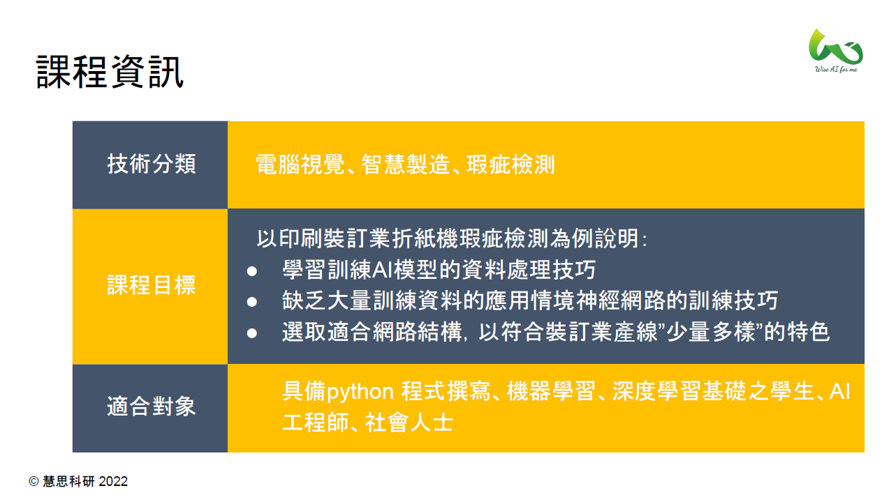
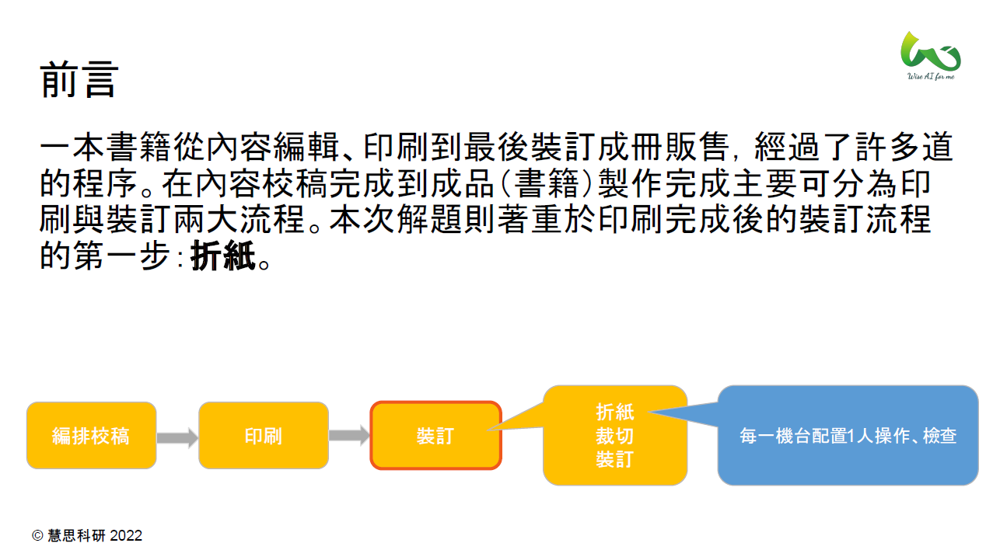

# 裝訂業機器摺紙精準度AI影像辨識

## 目錄
1. 單元1：問題描述
2. 單元2：解提構想與實務挑戰
3. 單元3：解決方案實作流程
4. 單元4：簡易物件偵測與實作
5. 單元5：孿生網路與實作
6. 單元6：結果與討論
7. 單元7：重點回顧

## 教學內容
[[程式碼教學]](colab/sn.ipynb)

[[學習簡報]](教學簡報/使用人體姿態檢測模型進行脊椎檢測.pdf)

